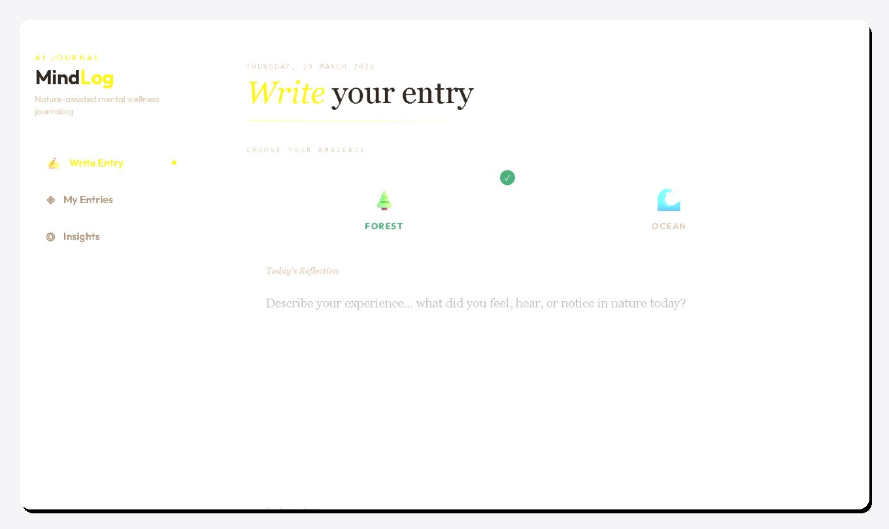
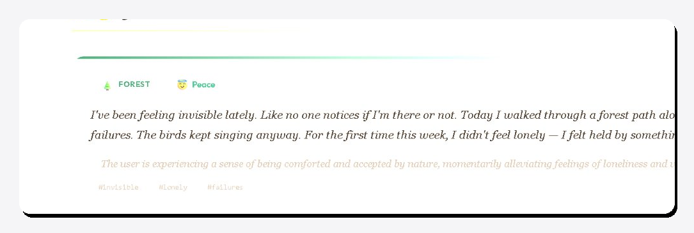
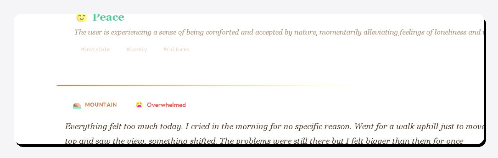
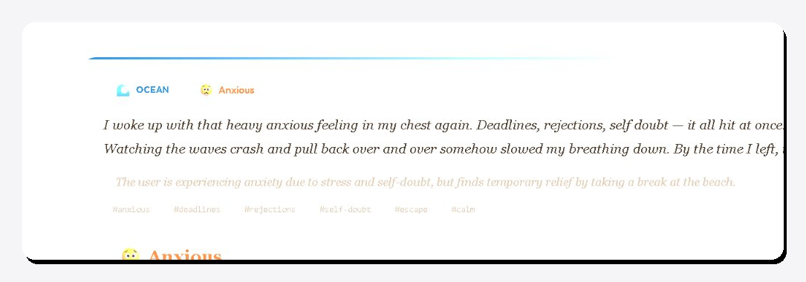
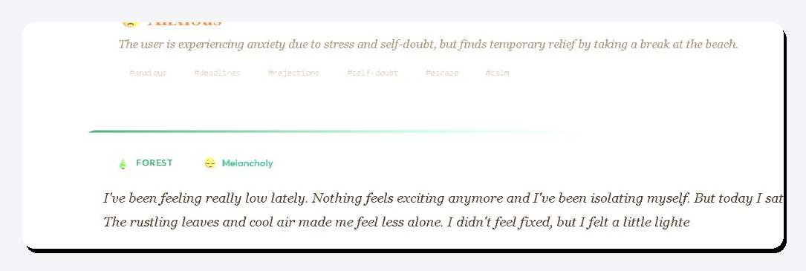

# 🌿 MindLog AI — AI-Assisted Nature Journal


**MindLog AI** is a full-stack journaling platform that helps users reflect on their daily experiences while automatically analyzing emotional patterns using a large language model — streamed in real time, token by token.

---

## 🔗 Live Links

| | |
|---|---|
| 🌐 **Frontend** | [mindlog-ai.vercel.app](https://mindlog-ai.vercel.app) |
| ⚙️ **Backend API** | [mindlog-ai-6s0s.onrender.com/api](https://mindlog-ai-6s0s.onrender.com/api) |
| 💻 **Source Code** | [github.com/abhijeetgupta1132/mindlog-ai](https://github.com/abhijeetgupta1132/mindlog-ai) |

---

## 📸 Screenshots

### ✍️ Write Your Entry — Choose Your Nature Ambience



---

### 🤖 AI Emotion Analysis — Real Results

> The AI detects the emotional state of each journal entry and responds with an emoji, label, insight summary, and relevant keywords.

| 🌲 Forest · 🕊️ Peace | 🏔️ Mountain · 😤 Overwhelmed |
|---|---|
|  |  |

| 🌊 Ocean · 😟 Anxious | 🌲 Forest · 😔 Melancholy |
|---|---|
|  |  |

---

## ✨ Features

- ✍️ Write and save daily journal entries
- 🌲 Choose a nature ambience — **Forest / Ocean / Mountain**
- 🤖 AI-powered emotion analysis using **Groq LLM (llama-3.1-8b-instant)**
- ⚡ **Real-time streaming** AI response via **Server-Sent Events (SSE)** — token by token
- 🧠 **AI response caching** (TTL: 1 hour) to reduce redundant LLM calls
- 📊 **Insights dashboard** — top emotion, favourite ambience, recurring keywords
- 🔒 **Rate-limited API** for stability and abuse prevention
- 🐳 **Docker + docker-compose** — entire app runs with a single command

---

## 🏗️ Architecture Overview

```
Client (React / Vercel)
        │
        │  HTTP / SSE
        ▼
Express API (Node.js / Render)
        │
        ├──► node-cache (TTL: 1hr)
        │         │
        │    cache hit? ──► return cached emotion result
        │         │
        │    cache miss?
        │         ▼
        ├──► Groq LLM API (llama-3.1-8b-instant)
        │         │
        │    streams tokens via SSE ──► Client (real-time)
        │
        └──► SQLite (better-sqlite3)
                  │
             persist journal entries + insights
```

---

## 🧠 Engineering Decisions

| Decision | Rationale |
|---|---|
| **SSE over WebSockets** | AI output is strictly server → client. SSE is HTTP-native, simpler to implement, and requires no extra infrastructure. |
| **SQLite over PostgreSQL** | Zero config, file-based, perfectly suited for single-user journaling. PostgreSQL noted as upgrade path for multi-user scale. |
| **node-cache over Redis** | Eliminates infra overhead for MVP scope. Identical interface makes Redis a drop-in upgrade when needed. |
| **Groq over OpenAI** | ~10x faster inference on llama-3.1-8b-instant. Free tier sufficient for demo scale. Lower latency improves streaming UX. |
| **Docker Compose** | Single-command setup lowers environment friction for contributors and interviewers running locally. |

---

## 🏛️ Tech Stack

| Layer | Technology |
|---|---|
| Frontend | React |
| Backend | Node.js + Express |
| Database | SQLite (better-sqlite3) |
| AI Model | Groq API — llama-3.1-8b-instant |
| Caching | node-cache (TTL: 1 hour) |
| Streaming | Server-Sent Events (SSE) |
| Deployment | Vercel (frontend) + Render (backend) |
| Containerization | Docker + docker-compose |

---

## ⚙️ Getting Started (Local Setup)

### Prerequisites

- Node.js 20+
- npm
- Groq API Key — free at [console.groq.com](https://console.groq.com)

### Backend Setup

```bash
cd backend
cp .env.example .env
```

Add your API key inside `.env`:

```env
GROQ_API_KEY=your_api_key_here
```

Install dependencies and start:

```bash
npm install
node server.js
```

Backend runs on: `http://localhost:3001`

### Frontend Setup

```bash
cd frontend
npm install
npm start
```

Frontend runs on: `http://localhost:3000`

---

## 🐳 Docker Setup (Recommended)

Run the entire application — frontend + backend — with a single command:

```bash
GROQ_API_KEY=your_key docker-compose up --build
```

| Service | URL |
|---|---|
| Frontend | http://localhost:3000 |
| Backend API | http://localhost:3001 |

---

## 📡 API Reference

### `POST /api/journal` — Create Journal Entry

```json
{
  "userId": "123",
  "ambience": "forest",
  "text": "I felt calm and focused today."
}
```

### `GET /api/journal/:userId` — Get All Entries

Returns all journal entries for a specific user.

### `POST /api/journal/analyze` — Analyze Emotion

**Request:**
```json
{
  "text": "I felt calm today.",
  "entryId": 5
}
```

**Response:**
```json
{
  "emotion": "calm",
  "keywords": ["rain", "nature", "peace"],
  "summary": "User experienced relaxation during the forest session"
}
```

### `POST /api/journal/analyze/stream` — Streaming Emotion Analysis (SSE)

Streams real-time emotion analysis token-by-token.

```
data: {"token": "The"}
data: {"token": " emotion"}
data: {"token": " detected"}
...
data: [DONE]
```

### `GET /api/journal/insights/:userId` — Get Insights

```json
{
  "totalEntries": 8,
  "topEmotion": "calm",
  "mostUsedAmbience": "forest",
  "recentKeywords": ["focus", "nature", "rain"]
}
```

---

## 🗺️ Project Structure

```
mindlog-ai/
├── frontend/
│   ├── src/
│   │   ├── components/       # React UI components
│   │   ├── pages/            # Journal, Insights, Dashboard
│   │   └── App.js
│   └── package.json
├── backend/
│   ├── server.js             # Express entry point
│   ├── routes/               # API route handlers
│   ├── services/
│   │   ├── groqService.js    # LLM + SSE streaming logic
│   │   └── cacheService.js   # node-cache wrapper
│   ├── db/                   # SQLite schema + queries
│   └── .env.example
├── docs/
│   └── screenshots/          # README screenshots
├── docker-compose.yml
└── README.md
```

---

## 📈 Roadmap

- [ ] User authentication (JWT / OAuth)
- [ ] Emotion trend visualization (charts over time)
- [ ] AI reflection suggestions based on journal history
- [ ] Mobile-responsive design
- [ ] Persistent caching with Redis
- [ ] Migrate to PostgreSQL for multi-user scale
- [ ] Export journal entries as PDF

---

## 👨‍💻 Author

**Abhijeet Gupta**
Computer Engineering Graduate · Full-Stack Developer

📧 [abhijeetgupta1134@gmail.com](mailto:abhijeetgupta1134@gmail.com)
🔗 [LinkedIn](https://www.linkedin.com/in/abhijeet-gupta-807876381)
💻 [GitHub](https://github.com/abhijeetgupta1132)

---

## 📄 License

This project is open source and available under the [MIT License](LICENSE).
